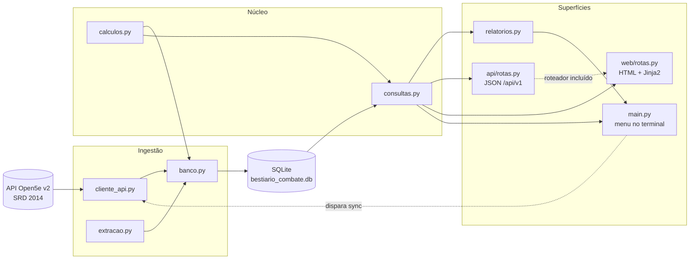
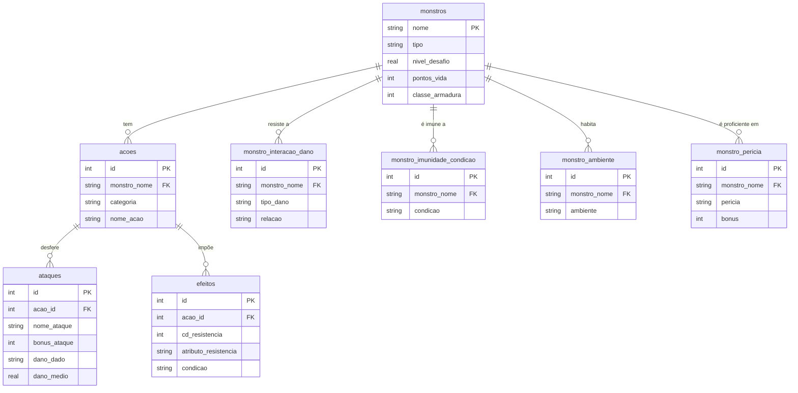

# Bestiário de D&D 5e


Site, API JSON e ferramenta de terminal para pesquisar e analisar os monstros de
Dungeons & Dragons 5ª edição. Os dados vêm da API pública **Open5e v2**, são
normalizados em um banco SQLite local e ficam disponíveis por três superfícies
diferentes — navegador, HTTP e linha de comando.

## Sobre

Projeto de estudo focado em consumo de API REST, modelagem relacional, extração de
dados de texto livre e projeto de API HTTP. O escopo é fixado no documento
**SRD 2014** da Open5e (`document__key=srd-2014`, 325 criaturas), o que elimina
duplicatas de outras fontes e mantém o nome do monstro como chave primária.

Duas ideias organizam o código:

- **Tudo vira dado consultável.** Cada ataque, efeito, tipo de dano e CD de
  resistência é um campo no banco — não texto. Isso é feito por uma **extração
  híbrida**, que combina os campos estruturados da API v2 com expressões regulares
  sobre a descrição de cada ação.
- **Duas superfícies, um núcleo.** O site (`web/`) e a API (`api/`) **não escrevem
  SQL**: os dois chamam `bestiario/consultas.py`, que é o único lugar do projeto que
  lê o banco. A camada de consulta não sabe se quem pergunta é um navegador, um
  script ou o menu do terminal.

## Funcionalidades

### Site (`web/`)

Três abas, HTML renderizado no servidor, visual inspirado nos livros oficiais.

- **Relatórios** — construtor de análises por cliques: dez filtros nomeados em
  português, com as opções vindas do vocabulário real do banco (e a contagem ao
  lado), mais uma faixa de nível de desafio. Uma escolha por vez — ver os monstros,
  ou comparar por uma de sete dimensões. Faixa de resumo sempre visível e seis
  presets prontos.
- **Pesquisar** — acumula fichas de monstros lado a lado, sem limite, para comparar.
  A busca sugere nomes enquanto se digita (consumindo a própria API) e continua
  funcionando como formulário comum sem JavaScript.
- **Todos os monstros** — os 325 em tabela, com seis colunas ordenáveis pela URL.

A navegação vai nos dois sentidos: o selo de uma ficha (`imune a fire`) abre o
relatório já filtrado, e o resultado do relatório volta para a aba Pesquisar como
filtros.

### API JSON (`api/`)

Seis endpoints somente-leitura em `/api/v1/`, erros em **RFC 7807**
(`application/problem+json`) e documentação navegável em `/docs`.

| Endpoint | O que devolve |
|---|---|
| `GET /api/v1/monstros` | Lista filtrada, ordenada e paginada |
| `GET /api/v1/monstros/{nome}` | Ficha completa, com ações, ataques e efeitos aninhados |
| `GET /api/v1/ataques` | Ataques individuais, ordenados por acerto ou dano |
| `GET /api/v1/comparacoes` | Métricas agregadas por dimensão (tipo, ambiente, condição...) |
| `GET /api/v1/resumo` | As seis métricas do recorte atual |
| `GET /api/v1/vocabulario` | Valores válidos de cada filtro, lidos do banco |

O contrato mora em [`openapi.yaml`](openapi.yaml) (OpenAPI 3.1) e é **verificado por
teste**: caminhos, parâmetros, campos e status codes do esquema gerado pelo código
são comparados com o arquivo commitado, barrando divergência silenciosa.

### Terminal (`main.py`)

- **Busca por nome** — consulta a Open5e e registra o monstro no banco local.
- **Filtro por tipo ou nível de desafio** — consulta o **banco primeiro** e só
  recorre à API quando não há dado local; cada resultado é rotulado com a origem
  (`[local]` ou `[API]`).
- **Sincronização completa** — baixa os 325 monstros do SRD 2014 de forma
  idempotente (re-sincronizar não duplica registros).
- **Sete relatórios** via pandas + tabulate: mais resistentes, ataques mais
  precisos, letalidade por tipo, monstros por ambiente, comparação entre tipos,
  imunidade/resistência/vulnerabilidade a dano e condições mais impostas.

## Pré-requisitos

- **Python 3.13** — não precisa instalar manualmente; o `uv` baixa o interpretador
  gerenciado.
- **[uv](https://docs.astral.sh/uv/)** — gerenciador de pacotes e ambiente.

A API Open5e é gratuita e sem autenticação: não há chaves nem variáveis de ambiente
para configurar.

## Instalação

```bash
git clone https://github.com/ArthurFigg/Bestiario_dEd_python.git
cd Bestiario_dEd_python
uv sync
```

## Uso

### 1. Popular o banco (obrigatório na primeira vez)

O banco `bestiario_combate.db` é um artefato gerado em tempo de execução e não vem
no repositório. Rode o menu e escolha a **opção 4**:

```bash
uv run python main.py
```

```
1. Buscar e registrar por nome
2. Buscar por tipo (local primeiro, API como fallback)
3. Buscar por desafio (local primeiro, API como fallback)
4. Sincronizar base completa no SQL     ← comece por aqui
5. Ver relatórios
6. Sair
```

A sincronização leva alguns minutos e traz 325 monstros, 1476 ações, 542 ataques,
518 efeitos e as tabelas de lista. Enquanto o banco estiver vazio, o site abre uma
página explicando o que fazer, em vez de quebrar.

### 2. Subir o servidor — site e API juntos

```bash
uv run uvicorn web.app:app --reload
```

| | |
|---|---|
| Site | http://127.0.0.1:8000/ |
| Todos os monstros | http://127.0.0.1:8000/monstros |
| API | http://127.0.0.1:8000/api/v1/monstros |
| Documentação | http://127.0.0.1:8000/docs |

Para subir **só a API**, sem o site:

```bash
uv run uvicorn api.app:app --reload
```

### 3. Relatórios no terminal, sem abrir o menu

```bash
uv run python -m bestiario.relatorios
```

## Arquitetura

<!-- diagrama:inicio -->


O dado entra pela Open5e uma vez, é extraído e persistido em SQLite, e daí em
diante **toda leitura passa por `consultas.py`**: terminal, JSON e HTML são três
saídas do mesmo núcleo, e nenhuma delas escreve SQL.

### Modelo de dados



Os diagramas mostram só os campos que identificam cada entidade — a lista
completa de colunas vive em `bestiario/banco.py`.
<!-- diagrama:fim -->

## Estrutura do projeto

```
Bestiario_dEd_python/
├── main.py                 # Ponto de entrada do terminal — menu interativo
├── openapi.yaml            # Contrato da API, comparado ao gerado pelo código
├── bestiario/              # Núcleo: domínio, dados e consulta (nada de web aqui)
│   ├── cliente_api.py      # Comunicação HTTP com a API Open5e v2 (SRD 2014)
│   ├── banco.py            # Schema SQLite e ingestão
│   ├── extracao.py         # Extração de ataques e efeitos do texto (regex híbrida)
│   ├── calculos.py         # Derivações puras: modificador, saves, média de dado
│   ├── consultas.py        # Único lugar que lê o banco — query parametrizada
│   ├── excecoes.py         # Erros de domínio (dimensão/filtro inválido)
│   └── relatorios.py       # Relatórios do terminal — delegam a consultas.py
├── api/                    # Superfície JSON — FastAPI, sem SQL próprio
│   ├── rotas.py            # Os seis endpoints de /api/v1/
│   ├── modelos.py          # Schemas Pydantic das respostas
│   └── erros.py            # Tradução das exceções de domínio para RFC 7807
├── web/                    # Superfície HTML — FastAPI + Jinja2, inclui a API
│   ├── rotas.py            # Raiz, /relatorios, /pesquisar e /monstros
│   ├── templates/          # base.html, as três abas e o bloco de ficha
│   └── static/             # CSS com as fontes embutidas e a busca incremental
├── tests/                  # Suíte pytest espelhando o pacote
└── pyproject.toml          # Projeto e dependências gerenciados pelo uv
```

## Banco de dados

Schema relacional normalizado de **8 tabelas**:

- `monstros` — atributos, CA, PV, desafio, sentidos, testes de resistência,
  deslocamento, alinhamento e idiomas.
- `acoes` e `ataques` — uma linha por ataque, com acerto, alcance, dado, tipo e
  média de dano.
- `efeitos` — CD de resistência, condição imposta e área geométrica.
- `monstro_interacao_dano`, `monstro_imunidade_condicao`, `monstro_ambiente`,
  `monstro_pericia` — uma linha por valor, para que contagens e cruzamentos sejam
  exatos.

Os valores são guardados em **chaves canônicas em inglês** da API (`fire`, `dragon`,
`prone`): tradução é camada de apresentação, não de armazenamento.

## Testes

```bash
uv run pytest -v
```

307 testes. A suíte nunca chama a API de verdade nem toca o banco real — mocks
apenas na fronteira HTTP, e a camada de consulta testada contra SQLite em memória
com uma fixture própria.

## Dependências

| Pacote | Versão | Uso |
|---|---|---|
| requests | `>=2.32,<3.0` | Chamadas HTTP à API Open5e |
| pandas | `>=2.2,<3.0` | Manipulação de dados nos relatórios |
| tabulate | `>=0.9,<1.0` | Formatação de tabelas no terminal |
| fastapi | `>=0.115,<1.0` | Servidor da API JSON e do site |
| uvicorn | `>=0.32,<1.0` | Servidor ASGI |
| jinja2 | `>=3.1,<4.0` | Templates HTML renderizados no servidor |

Desenvolvimento: `pytest`, `httpx` (exigida pelo `TestClient`) e `pyyaml` (lê o
`openapi.yaml` no teste de contrato).

## Destaques técnicos

- **Extração híbrida** — o array estruturado da API v2 enumera os ataques (acerto e
  alcance confiáveis), enquanto a regex sobre a descrição serve de gabarito para o
  dano, cujo campo estruturado da v2 é notoriamente incorreto. Fallback ao
  estruturado quando a regex não casa.
- **Contrato verificado por teste** — a implementação é code-first com FastAPI, e um
  teste compara o OpenAPI gerado com o `openapi.yaml` commitado. Documentação que
  mente sobre a API quebra o build.
- **SQL num lugar só** — `consultas.py` monta a query a partir de filtros nomeados
  com lista branca, valida cada valor contra o vocabulário lido do banco, e ordena,
  conta e pagina no próprio SQL. Filtro em tabela filha usa subconsulta `EXISTS`, e
  não `JOIN`, porque `JOIN` multiplicaria linhas e estragaria contagem e média.
- **Erro se divide por superfície, não por causa** — banco não sincronizado vira
  página HTML com status 200 no site (é o estado inicial, não uma falha) e 503 em
  RFC 7807 sob `/api/`. Quem decide é uma função só, registrada pelas duas entradas.
- **Ingestão idempotente** — `INSERT OR REPLACE` no monstro e limpeza das linhas
  filhas antes da reinserção, respeitando a ordem imposta pelas foreign keys.
- **Sem etapa de build no front** — HTML no servidor, um arquivo CSS com as fontes
  (Cinzel e EB Garamond, ambas SIL OFL) embutidas em base64, e um único JavaScript
  opcional para as sugestões de busca.

## Limitações conhecidas

- A **média de dano agregada** conta apenas o dano primário. O Bite do Adult Red
  Dragon entra como 19, não 26 — os 2d6 de fogo secundários ficam de fora. O valor
  por ataque está correto no banco e a API publica os dois campos; a perda existe
  só nos agregados (coluna de lista, comparação e faixa de resumo).
- **Extração de efeitos é lossy por natureza** — CD de resistência, condição e área
  não têm campo estruturado na API v2, então saem 100% de regex sobre a descrição.
- **Interface em inglês nos valores** — tipos, condições e ambientes aparecem como
  vêm da API (`dragon`, `prone`, `forest`). A tradução para português está planejada
  como camada de apresentação, sem tocar o banco.
